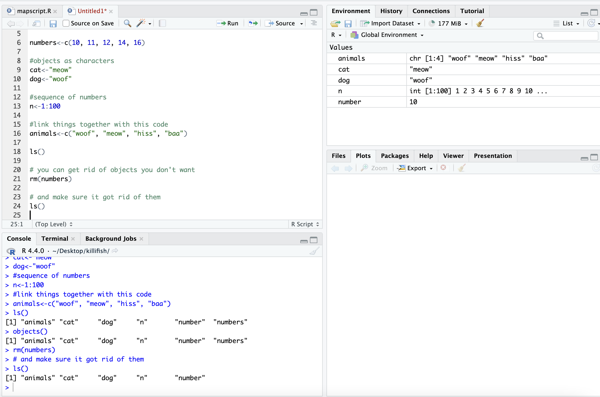

```{r setupq5, include=FALSE}
knitr::opts_chunk$set(echo = TRUE)
```

# Week 5- Welcome to the R environment!

This lesson is modified from materials compiled by Serena Caplins from
the STEMinist_R lessons produced by several UC Davis graduate student
and which can be found
[here](https://github.com/ecalfee/STEMinist_R.git). The lecture slides
to introduce R more in depth are here: [Week 5 Slides](./figs/W5_R.pdf))

## Main Objectives

-   Learn how to use Rstudio through FarmOnDemand
-   Understand the different parts of the Rstudio window
-   Learn how to work with objects in R and general R operations
-   Learn how to manipulate data and explore a dataframe

## Orientation to R

First let's navigate to our R studio on Farm OnDemand! Launch your
session with the information shown below 

After we start it up we will want to create a new file called
"Week5-IntroR.R" to type our scripts for today.

To do this, we will click `File`, `New File` then `R script`. Name your
file with your `name-Week5-introR`

`#` before a sentence comments out what you want before you write code.
Without a `#` R will think what you are writing needs to be run as a
command! I have used comments in this example to write what the script is for. The top left is the script, the bottom left is the terminal window where code and outputs will be typed, the top right is your environment 

R can be used for basic arithmetic. Type this into your script and hit
enter:

```{r , echo=T}
#adding prompt
5+10+23

```

It can also store values in variables:

You can assign an object using an assignment operator `<-` or `=`.

```{r , echo=T}
#storing variables
number<-10

numbers<-c(10, 11, 12, 14, 16)
```

You can see your assigned object by typing the name you gave it.

```{r , echo=T}
#assigned objects
number

numbers

```

Objects can be numbers or characters:

```{r , echo=T}
#objects as characters
cat<-"meow"
dog<-"woof"


```

We can use colons to get sequences of numbers:

```{r , echo=T}
#sequence of numbers
n<-1:100

```

Data Structures include:

1.  Vector

2.  Lists

3.  Matrices

4.  Factor

5.  Data frame

Vectors can also include characters (in quotes): `c()`=concatenate, aka
link things together!

```{r , echo=T}
#link things together with this code
animals<-c("woof", "meow", "hiss", "baa")

```

## Manipulating a vector object

We can get summaries of vectors with `summary()`

```{r , echo=T}
#summarize what you have done so far
summary(n)

```

We can see how long a vector is with `length()`

```{r , echo=T}
#how long is vector n
length(n)

```

You can use square brackets `[]` to get parts of vectors. This returns the 50th entry in our vector `n` and the 2nd entry in our vector `animals`.

```{r , echo=T}

#what is the 50th entry in our vector n?
n[50]

#what is the 2nd entry in our vector animals?
animals[2] 

```

## Operations act on each element of a vector:

```{r , echo=T}

# +2
numbers+2

# *2
numbers*2

# mean
mean(numbers)

# ^2
numbers^2

# sum
sum(numbers)

```

## Operations can also work with two vectors:

```{r , echo=T}

#define a new object y
y<-numbers*2

# n + y
numbers + y

# n * y
numbers * y

```

## A few tips below for working with objects:

We can keep track of what objects R is using, with the functions `ls()`
and `objects()`

```{r , echo=T}
ls()
objects() #returns the same results as ls() in this case. because we only have objects in our environment.
```

This is where those objects show up with you type `ls()`: 

```{r, echo=T}
# how to get help for a function; you can also write help()
?ls

# you can get rid of objects you don't want

rm(numbers)

# and make sure it got rid of them
ls()

```



Call the help files for the functions ls() and rm() + What are the
arguments for the ls() function? + What does the 'sorted' argument do?

From the help file: sorted is a logical indicating if the resulting
character should be sorted alphabetically. Note that this is part of
ls() may take most of the time.

## Characterizing a dataframe

We'll now move from working with objects and vectors to working with
dataframes:

-   Here are a few useful functions! I will go over each as we introduce
    them throughout the lesson today:
    -   install.packages()
    -   library()
    -   data()
    -   str()
    -   dim()
    -   colnames() and rownames()
    -   class()
    -   as.factor()
    -   as.numeric()
    -   unique()
    -   t()
    -   max(), min(), mean() and summary()

We're going to use data on sleep patterns in mammals. This requires
installing a package (ggplot2) and loading the data

Install the package `ggplot2`. This only has to be done once and after
installation we should then **comment out the command to install the
package with a #.**

```{r, echo=T}

#install.packages("ggplot2")

#load the package

library (ggplot2)
```

Load the data (it's called msleep). This dataset includes information
bout mammal sleep times and weights that was taken from a study by V. M.
Savage and G. B. West. "A quantitative, theoretical framework for
understanding mammalian sleep. Proceedings of the National Academy of
Sciences, 104 (3):1051-1056, 2007."

The data includes `name` (common name), `genus`, `vore` (carnivore,
omnivore, etc), `order`, `conservation` (status), `sleep_total` (total
amount of sleep in hours), `sleep_rem` (rem sleep in hours),
`sleep_cycle` (length of sleep cycle, in hours), `awake` (amount of time
spent awake, in hours), `brainwt` (brain weight in kilograms) and
`bodywt` (body weight in kilograms)

```{r, echo=T}

data("msleep")
```

There are many functions in R that allow us to get an idea of what the
data looks like. For example, what are it's dimensions (how many rows
and columns)?

```{r, echo=T}

# head() -look at the beginning of the data file
# tail() -look at the end of the data file

head(msleep)
tail(msleep)

# str()
str(msleep)
```

dim(), ncol(), nrow()- dimensions, number of columns, number of rows
colnames(), rownames() - column names, row names

Rstudio also allows us to just look into the data file with `View()`.
Try to look at the msleep data using `View(msleep)`

## How to access parts of the data:

We can also look at a single column at a time. There are three ways to
access this: \$, [,#] or [,"a"].

Think about "**R**emote **C**ontrol car" to remember that [5,] means
fifth row and [,5] means fifth column! Rows are listed first and columns
are listed second.

Each way has it's own advantages! The first subsets the third column of
data, so you need to know where your data of interest is. The second
subsets the `vore` column only. The third prints all of the data from
the `vore` column in your console window.

```{r, echo=T}

msleep[,3]
msleep[, "vore"]
msleep$vore

```

If you wanted to save these as objects, you need to add an arrow an a
new name for that object.  They should all be the same!

```{r, echo=T}

column3<-msleep[,3]
voreonly<-msleep[, "vore"]
vores<-msleep$vore

head(column3) #do this or View() for all of your new objects!
```

It's important to know the class of data if you want to manipulate it.
For example, you can't add characters. `msleep` contains several
different types of data. We see with `str()` that there are columns of
data that are characters and numeric.

Data Types/Classes:

-   Character (names)

-   Numeric (numbers)

-   Logical (T/F)

-   Integer (2L for example)

-   Complex (imaginary #s)

-   Raw (not really used)


```{r, echo=T}

class(msleep$vore) #character!

class(msleep$sleep_total) #numeric!
```

We can also look at a single row at a time. There are two ways to access this: 

- by indicating the row number in square brackets next to the
name of the dataframe `name[#,]`
- by calling the actual name of the row (if your rows have names) `name["a",]`.

```{r, echo=T}

msleep[43,]
msleep[msleep$name == "Mountain beaver",]

```


<https://www.nps.gov/articles/000/mapping-mountain-beavers-in-point-reyes-a-collaboration-between-the-national-park-service-and-uc-berkeley.htm>

We can select more than one row or column at a time:

```{r, echo=T}
 # see two columns

msleep[,c(1, 6)]

 # and make a new data frame from these subsets

subsleep<-msleep[,c(1, 6)]

```

But what if we actually care about how many **unique** things are in a
column?

```{r, echo=T}
 # unique()
unique(msleep[, "order"])

 # table()
table(msleep$order)

 # levels(), if class is factor (and if not we can make it a factor) showing the way that the data is displayed
levels(as.factor(msleep$order))

```

## Data Manipulation

If your data is transposed in a way that isn't useful to you, you can
switch it. Note that this often changes the class of each column!

In R, all entries within a column must have the same format to be
interpreted :

```{r, echo=T}
 # t()

tr_msleep<-t(msleep)

str(tr_msleep)

```


Often we want to summarize data. There are many ways of doing this in R:

```{r, echo=T}

 # calculate mean() of a column
mean(msleep$sleep_total)

 # max()
max(msleep$sleep_total)

 # min()
min(msleep$sleep_total)

 # summary()
summary(msleep$sleep_total)
```

Sometimes, the values we care about aren't provided in a data set. When
this happens, we can create a new column that contains the values we're
interested in:

```{r, echo=T}

  # what if what we cared about was our sleep_total/sleep_rem ratio?
  # add a sleep_total/sleep_rem ratio column to our msleep dataframe with $
msleep$total_rem<-msleep$sleep_total/msleep$sleep_rem

  # look at our dataframe again. It now contains 12 columns, one of them being the one we just created.
head(msleep)

```

Let's use the built in iris dataset for a class exercise: This dataset
was published by Ronald Fisher in his 1936 paper: "The use of multiple
measurements in taxonomic problems". It has three plant species (setosa,
virginica, versicolor) and four morphological traits measured for each
sample in centimeters: Sepal.Length, Sepal.Width, Petal.Length and
Petal.Width.


## Practice exploring a dataframe

Reminder of those useful commands: dataframename[row , col], str(),
dim(), nrow(), unique(), length(), rownames(), summary(), min(), max(),
mean(), range(), levels(), factor(), as.factor(), class(), ncol(),
nrow(), table(), sum(), quantile(), var()

We'll use the built-in 'iris' dataset. the command: `data(iris)` \# this
loads the 'iris' dataset. You can view more information \> about this
dataset with `help(iris)` or `?iris`

> ### Class Exercise
>
> -   How many rows are in the dataset? What are three distinct ways to
>     figure this out?

> -   How many species of flowers are in the dataset? What class is
>     'iris' ?

> -   How many columns does this data frame have? What are their names?

> -   What class did R assign to each column?

> -   Now for writing your own commands. Assign the first flower's
>     petal's width and length to new objects called setosa1.petalwidth
>     and setosa1.petallength. Then Calculate the approximate area of
>     the petal of the first flower, setosa1 (assume petal area can be
>     approximated by a rectangle).

> -   Next, calculate the petal area of each flower in the iris dataset
>     and assign this to a new column named PetalArea.

> -   What is the maximum sepal length of the irises? What about the
>     minimum, median and average sepal length among all flowers in the
>     dataset?

## Subsetting datasets & logicals

A few useful commands: equals `==`, does not equal `!=`, greater than
`>`, less than `<`, and `&`, and a pipe which can also indicate "and"
`|`.

Reminder there are two assignment operators in R `<-` and a single
equals sign `=`. The one you use really depends on how you learned to
use R, and are otherwise equivalent.

**Logical conditions vs. assignment operators:**

Logical values of TRUE and FALSE are special in R. What class is a
logical value?

```{r, echo=T}
TRUE
FALSE

# what class is a logical value?

class(TRUE)

```

Logical values are stored as 0 for FALSE and 1 for TRUE. Which means you
can do math with them!

```{r, echo=T}

TRUE + 1
FALSE + 1

sum(c(TRUE,TRUE,FALSE,FALSE))

!TRUE

!c(TRUE,TRUE,FALSE,FALSE)
```

Logicals will be the output of various tests:

```{r, echo=T}

1 == 1
1 == 2

 # does not equal

1 != 1
1 != 2

 # greater than

1 > 1
1 >= 1

 # less than

1 < 3

 # combining logical conditions with and (&), or(|)

1 == 1 & 2 == 2
1 == 1 & 1 == 2
1 == 1 | 1 == 2
 
 # we can take the opposite of a logical by using !

!TRUE
```

This is very useful because we can use logicals to query a data frame or vector.

```{r, echo=T}

# in our msleep data frame, which species have total sleep greater than 18 hours?
# reload the msleep data with library(ggplot2) and data(msleep) if you need to

msleep[,"sleep_total"]>18

 # Using which() to identify which rows match the logical values (TRUE) and length to count how many species there are

which(msleep[,"sleep_total"]>18)  #22 37 43 62 --> the rows that contain organisms that sleep more than 18 hrs

length(which(msleep[,"sleep_total"]>18)) #4 --> number of species that sleep more than 18 hrs 

 # which four species are these?

msleep[which(msleep[,"sleep_total"]>18),]

# what if we only want to see the bats that sleep more than 18 hours per 24 hour period?

msleep[which(msleep[,"sleep_total"]>18 & msleep[,"order"] == "Chiroptera"),]

```

## Group Work Activity: Practice Exploring Data in R

We are going to use the same iris dataset for our class activity this
week and explore it more. Include copied text from your R script that is
relevant to the questions below in your submission and answers to the
following questions. Remember you can work in groups but everything is
submitted individually. Go back to the iris dataset, which can be loaded
with `data(iris)` and submit code and answers for the following
questions:

> -   Q1. How many irises have sepals less than 5.5 cm?
> -   Q2. Which iris individual has the largest petal length? What is
>     the width of it's petal?
> -   Q3. How many of the irises are in this dataset belong to the
>     species versicolor?
> -   Q4. How many irises have petals longer than 6cm? Then create a
>     vector of species name for each iris with sepals longer than 6cm.
> -   Q5. How many irises have sepals shorter than 5cm, but wider than
>     3cm?
> -   Q6. How many irises have petals narrower than 0.2cm or shorter
>     than 1.5cm?
> -   Q7. What is the average width of *setosa iris* sepals that are
>     longer than 5cm?
> -   Q8. What is the difference between the longest and shortest petal
>     lengths of the species *virginica*?
> -   Q9. What proportion of flowers in the dataset have petals wider
>     than 1cm?
> -   Q10. Okay final step! Create a new column within your dataframe,
>     called sepalCategory, and set all values equal to 'long' Subset
>     short values of this column, and set their values to 'short'
>     (Short sepals are those less than 5.5 cm) How many plants with
>     short sepals are there? How many long?

## Key Points

-   Useful functions such as `install.packages()`, `library()` can help
    us upload packages and data from R, while other functions such as
    `str()`, `dim()`, and `unique()` can help us investigate dataframes
-   To look at our data we can use several commands, including `view()`
    or `data$columnofinterest` if you only want to look at one variable.
-   Manipulating data in R can be extremely helpful in the analysis
    stage, and we can get data on `mean()`, `min()`, `max()`, and
    `summary()` data on different variables of interest

<details>

<summary>[Class Exercise Solution]{style="color: orange;"}</summary>

<p>

> > ## Class Exercise: Solution

```{r, echo=T}

data(iris)

nrow(iris) #can also use nrows, str and dim

levels(iris$Species) 
class(iris)
colnames(iris)

str(iris) #look at structure

# Assign the first flower's petal's width and length to new objects called setosa1.petalwidth and setosa1.petallength. Then Calculate the approximate area of the petal of the first flower, setosa1 (assume petal area can be approximated by a rectangle).
setosa1.petalwidth<-iris[1,2]

setosa1.petallength<-iris[1,3]

#area of petal of the first flower
setosa1area2<-setosa1.petalwidth*setosa1.petallength

#petal area of each flower
iris$PetalArea<-iris$Petal.Length*iris$Petal.Width

#max sepal length
max(iris$Sepal.Length)

#minimum sepal length
min(iris$Sepal.Length)

#average sepal length
mean(iris$Sepal.Length)

#median sepal length
median(iris$Sepal.Length)
```

</p>

</details>
