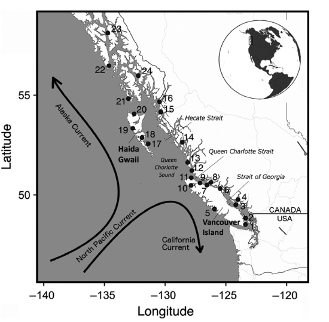
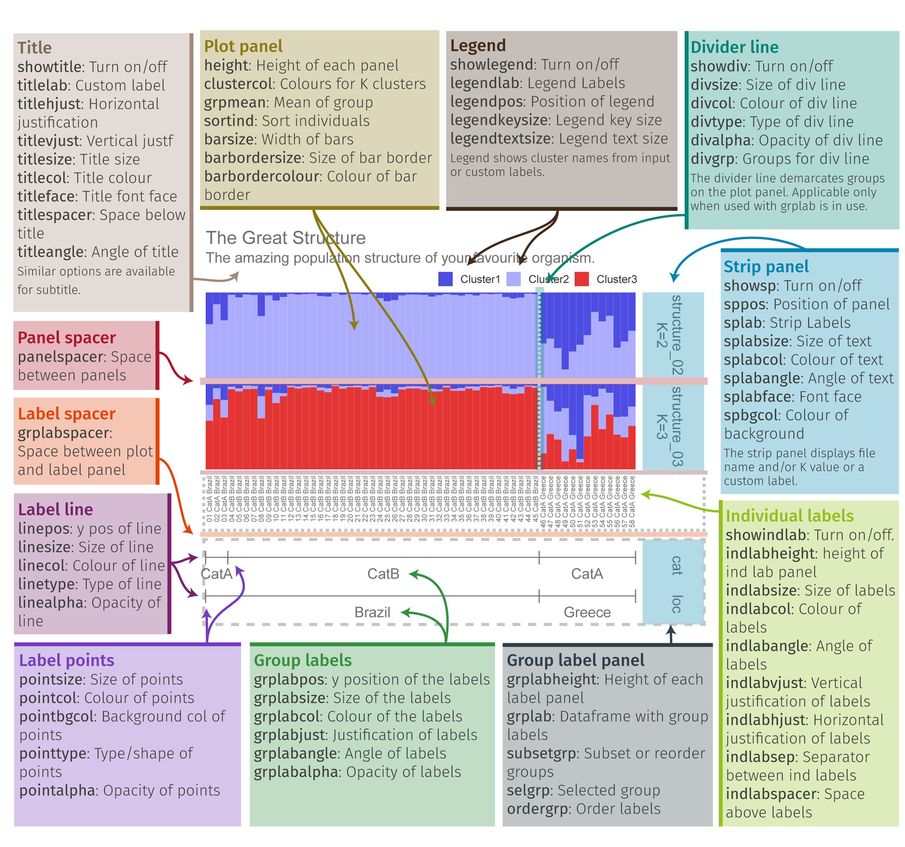
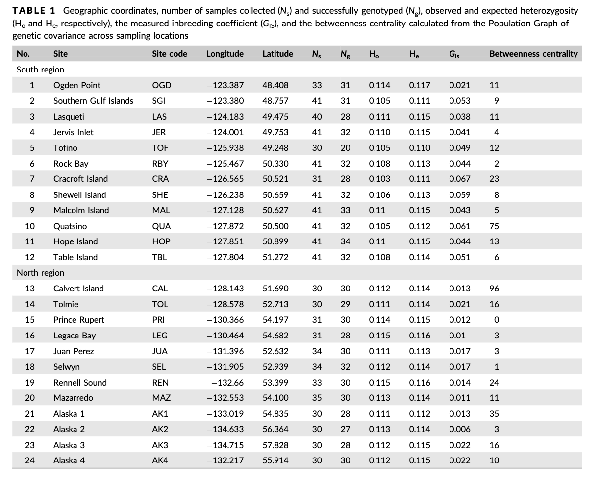

--- 
title: "Introduction to Genomics"
site: bookdown::bookdown_site
documentclass: book
bibliography: [book.bib, packages.bib]
biblio-style: apalike
link-citations: yes
description: " "
---

# Intro to Genomics in Natural Populations

Placeholder


## Course Learning Objectives
## Meet your instructors!
## Getting your Farm Account set up (class specific)

<!--chapter:end:index.Rmd-->


# Week 1- Welcome!

Placeholder


## Main Objectives
## How to access the shell via Farm OnDemand
## Navigating your file system
## Shortcut: Tab Completion
## Creating our own directories 
## Full vs Relative Paths
## Examining the contents of other directories
## Group Work Activity- Treasure Hunt!
## Key Points

<!--chapter:end:01-Week1.Rmd-->


# Week 2- Working with Files

Placeholder


## Main Objectives:
## Navigational shortcuts
## Sequencing Pipeline
## Details on the FASTQ format
## Our data set: FASTQ files
## Wildcards
## Command History
## Examining Files
## Group Work Activity- Examining a Fastq File
## Key Points

<!--chapter:end:02-Week2.Rmd-->


# Week 3- Working with Files Part 2

Placeholder


## Main Objectives
## Creating, moving, copying, and removing
### Copying Files
### Creating Directories
### Moving / Renaming 
### File Permissions
### Removing
## Searching files
## Redirecting output
## File extensions
## Writing for loops
## Using Basename in for loops
## Writing Scripts and Working with Data
## Writing scripts: Bash
## Writing scripts: Slurm
## Group Work Activity- Writing your own script
## Key Points
## Additional Information 
### Uploading and Downloading Data to your Virtual Machine with scp - UNIX
## More ways to work with files
### Awk

<!--chapter:end:03-Week3.Rmd-->


# Week 4- What is a Genetic Variant?

Placeholder


## Main Objectives
## Step 1: Download data
### Getting data from the cloud
### tools for today's class
## Step 1.2: Raw read quality control
## Step 2: Trimming to remove adapters
## Step 3: Building an index of our genome
## Step 4: Map reads to the genome
## Step 5: sam to bam file conversion
## Step 6: Genotype likelihoods
## Group Work Activity- Calling Variants at a Larger Scale
## Key Points

<!--chapter:end:04-Week4.Rmd-->


# Week 5- Welcome to the R environment!

Placeholder


## Main Objectives
## Orientation to R
## Manipulating a vector object
## Operations act on each element of a vector:
## Operations can also work with two vectors:
## A few tips below for working with objects:
## Characterizing a dataframe
## How to access parts of the data:
## Data Manipulation
## Group Work Activity: practice exploring a dataframe
## Key Points

<!--chapter:end:05-Week5.Rmd-->


# Week 6- Plotting in R

Placeholder


## Main Objectives
## Subsetting datasets & logicals
## Plotting in Base R
### Scatterplots
### Histograms
## Plotting with ggplot2
## For loops and the apply family of functions
## Group Work Activity: Palmer Penguins!
## Key Points

<!--chapter:end:06-Week6.Rmd-->

---
title: "07-Week7"
author: "M. Armstrong"
date: "2025-05-02"
output:
  bookdown::html_book:
    toc: yes
    css: toc.css
---

```{r setupq7, include=FALSE}
knitr::opts_chunk$set(comment = "#>", echo = TRUE, fig.width=6)
```

# Week 6- Population Structure 
We will be using data from the [Xuereb et al. 2018 paper on P. californicus](https://onlinelibrary.wiley.com/doi/abs/10.1111/mec.14589) to learn how to identify population structure and make structure plots using tess3r and pophelper. This data is SNP data from 15 individuals per site across 7 collection sites:


More information on the paper and it's findings are in the lecture slides here: SLIDES on structure plots + paper

## Main Objectives:
- Learn what a structure plot is and how it can give us useful information on population structure in our dataset
- Learn how to make a structure plot using tess3r and pophelper
- Practice moving from terminal to R when working with big data

## Download the data in terminal
We first need to download the data in terminal. So navigate to your directory and do the following command to get the vcf file we need onto your farm desktop. I got the data from the dryad (data repository) for this paper and zipped it to be more easily downloaded: https://datadryad.org/dataset/doi:10.5061/dryad.db6177b

``` html
cd /group/rbaygrp/eve198-genomics/yourdirectory
wget https://raw.githubusercontent.com/mlarmstrong/IntroGenomics_Data/main/week6.zip
```
Unzip the week6 directory and navigate inside. There should be three files: a vcf file (with our genetic data), a csv file (with our samples and coordinate data) and a README.txt file. The README.txt gives you information on the dataset you just downloaded. The .csv file in this folder is our metadata, with coordinates for each of our sample sites along with sample names. This will be useful for understanding population structure between populations and across space!

## Moving to R:
Now we will move to R! We will need quite a few packages today since we will be using `tess3r` to identify population structure and then `pophelper` to visualize that structure in a more organized way. We also need to be able to read in a vcf file, so `vcfR` is a useful package for that. `adegenet()` is a package that will help us do additional analyses on our genetic data.


Remember that you first need `install.packages()` and then use `library()` to load each package! You will need to use `devtools::install_github("bcm-uga/TESS3_encho_sen")` to load `tess3r()`. After you have loaded each package you can get more information on each of them by doing `?tess3r()`

```{r echo=T}
library(tess3r)
library(vcfR)
library(pophelper)
library(ggplot2)
library(adegenet)
```
## set your working directory
Now that we are working with downloaded data it is important to set your working directory in R so you know where to store your files. I would recommend just saving your script and all of the data for today into your week6 directory in your named directory. To set your working directory you can do the following: `setwd("~/where/you/are/storing/data/week6")`

If you click the files tab on the right you should be able to see all of the files in your working directory too!


## read vcf file
Now let's read in our data! This will take a second and you will get information on the file in your console as it is read in. The number of variants that are processed should be 2,719. Then you can extract the genotypes with the second line of code.
```{r, echo=F}
vcf_cukes<-read.vcfR("filtered_2719neutral_snps.recode.vcf")
genotypes_raw<-extract.gt(vcf_cukes)
```
If you do `head(genos_raw)` you can see that the format is 0/0 or 1/1 for homozygotes and 0/1 for heterozygotes. We actually want to convert this to instead be 0 for homozyous reference, 1 for heterozygotes and 2 for homozyogous alternate. To do this, you can run the following code:

```{r echo=T}
## Replace genotype codes with numeric values
genotypes_cleaned <- as.matrix(apply(genotypes_raw, c(1, 2), function(x) {
  if (x %in% c("0/0", "0|0")) return(0)    # Homozygous reference → 0
  if (x %in% c("0/1", "1/0", "0|1", "1|0")) return(1)  # Heterozygous → 1
  if (x %in% c("1/1", "1|1")) return(2)    # Homozygous alternate → 2
  return(NA)             # Handle missing or other cases
}))

```

Check to see that it worked by doing `View(genos_col)` or `head(genos_col)`. The genotypes should be coded as 0, 1 or 2. Finally let's check the dimensions of our genotype data. The number of individuals should be on the left and the genotypes should be on the right.

```{r, echo=T}
dim(genotypes_cleaned) #indiv should be on left, genotypes on right
```
It looks like it is actually flipped, so let's fix that! The command `t()` will help us transpose our data

```{r, echo=T}
genotypes<- t(genotypes_cleaned) 
dim(genotypes) #now it is right!
```

## read in the metadata
Now let's read in the coordinate data for our sample sites! We will also make an object "coordinates" to hold our lat/long data for the tess3 object later. Our `sites.data` should a length of 717 to match our genotype data.
```{r, echo=T}
sites.data<-read.csv('strata.cucumbers.717ind.csv', header=TRUE, sep=",")
coordinates<-as.matrix(cbind(sites.data$LAT, sites.data$LONG))
dim(sites.data)
```

## population structure with tess3r
You can learn more about this package on their tutorial page (https://bcm-uga.github.io/TESS3_encho_sen/articles/main-vignette.html), but in short tess3 is a function that computes population structure by estimating ancestry proportions and ancestral allele frequencies. In the code below:
- X argument refers to the genotype matrix
- coord argument the coord argument corresponds to the geographic coordinates
- K is the number of clusters or ancestral population
- reps is the number of reps for cross validation

Normally we would want multiple reps to ensure things are being calcuated correctly, but for class we will only do 2.


```{r, echo=T}
tess3.cukes <- tess3(X=genotypes, coord =as.matrix(cbind(sites.data$LAT, sites.data$LONG)), K=1:8,
                     ploidy=2, lambda=0, keep="best",rep=2)
```

## How do we know which K to pick?
This will take a second since it is real genomic data! We started with 8 clusters. But how do we actually choose a K? 

In order to get an accurate estimate of the "best" K for our data we first need to run a larger range of K, here 1:8, and then look at our data and see how the cross-validation score compares to the number of predicted ancestral populations. We can do that with the code below:

The plot function generates a plot for root mean-squared errors computed on a subset of loci used for cross-validation:
```{r, label='7.1', echo=T}
plot(tess3.cukes, pch = 19, col = "orange",
     xlab = "Number of ancestral populations",
     ylab = "Cross-validation score") 
```

It looks like there might just be two clusters, since the cross-validation score drops between 1 and 2 ancestral populations. Let't make a matrix using qmatrix for K+2 and visualize a structure plot with that!

```{r, echo=T}
# retrieve tess3 Q matrix for K = 2 clusters 
cukes.matrix <- qmatrix(tess3.cukes, K = 2)
```

```{r, label='7.2', echo=T}
#now the barplot
barplot(cukes.matrix, border = NA, space = 0, 
        xlab = "Individuals", ylab = "Ancestry proportions", 
        main = "Ancestry matrix") -> bp
axis(1, at = 1:nrow(cukes.matrix), labels = sites.data$Sample,las = 3, cex.axis = .4) 
```

Yay our first structure plot! It isn't orded by site though and it is not easily interpreted. However what we can get from this figure is that it looks like 2 groups are in this dataset, so K=2 makes sense to move forward with.

## Visualizing population structure with pophelper!
Pophelper is a really useful tool for visualizing population strucutre graphs. You can view the tutorial here for more information: https://www.royfrancis.com/pophelper/articles/index.html#plotting-1. We can do a lot of customization in pophelper, and this figure shows what our final result will look like!



1. First we need to convert our tess3 object to a qlist for pophelper

```{r, echo=T}
library(pophelper) #install this package first
qlist.cukes <- readQTess3(t3list=tess3.cukes)
is.qlist(qlist=qlist.cukes)#verify format
```
2. Then we need to specify the order that we want our sites to be in and the different labels for our structure plot. The first is our population order. We want it to match the map figure and the table in the paper, so let's order from South to North. To get the sames of the sites we can do the following:

```{r, echo=T}
unique(sites.data$SITE)
```

Our sites are "OGD" "SGI" "LAS" "JER" "TOF" "CRA" "RBY" "SHE" "MAL" "QUA" "HOP" "TBL" "CAL" "TOL" "PRI" "LEG" "JUA" "SEL" "REN" "MAZ" "AK1" "AK2" "AK3" "AK4". 



Table 1 from the paper shows the sites south to north. Luckily the dataset is already sorted appropriately, so now we can just put this into a new object!

```{r, echo=T}
ordered.sites=c("OGD", "SGI", "LAS" ,"JER" ,"TOF" ,"CRA" ,"RBY", "SHE", "MAL", "QUA", "HOP", "TBL", "CAL", "TOL", "PRI", "LEG", "JUA", "SEL", "REN", "MAZ", "AK1", "AK2" ,"AK3", "AK4")
```

We also want to label our two structure plots with what K equals, so add that with the object "labels"
```{r, echo=T}
labels <- c("K=2", "K=3")
```
3. Now that we have our labels we can pull the data that we want from our different files

```{r, echo=T}
slist.cukes <- alignK(qlist.cukes[2:3],type="auto")
labset<-data.frame(sites.data)
```

4. Now we can plot our data! To visualize we can load one final library, `gridExtra()`
```{r, label='7.3', echo=T}
library(gridExtra)
#plot samples separated by site
p<-plotQ(slist.cukes,imgoutput="join",returnplot=TRUE,exportplot=FALSE,basesize=11,
            splabsize=7,height=7,
            grplab=data.frame(SITE=labset$SITE),subsetgrp=ordered.sites,
            grplabsize=3,linesize=1,pointsize=3,splab=labs,grplabangle=0,
            grplabheight = 5)
```


```{r, label='7.4', echo=T}
grid.arrange(p$plot[[1]])
```
## Adding more meaning to our plot
The site names may mean something if you are familiar with this area or have read the paper, but how can we make our plot easier to understand? One way could be to add what countries these samples were taken in so you can get a sense of sampling area. A really useful package for data manipulation that we haven't used yet is called `dplyr()`. Remember to install it with `install.packages()` and then load it with `library()`

The newest thing that you will see with dplyr is ` %>% `. This is called a pipe, and connects lines of code together.

To add a new column we will need to define what the new column will be named and then provide information to fill that column

```{r,  echo=T}
library(dplyr)
sites.data<-sites.data %>% 
  mutate(Country=case_when(
    SITE %in% c("OGD", "SGI", "LAS" ,"JER" ,"TOF" ,"CRA" ,"RBY", "SHE", "MAL", "QUA", "HOP", "TBL", "CAL", "TOL", "PRI", "LEG", "JUA", "SEL", "REN", "MAZ") ~"British Columbia, Canada",
    SITE %in% c("AK1", "AK2" ,"AK3", "AK4") ~ "Alaska, USA"))
```

View `sites.data` before moving on to ensure you got the column! Now we can repeat some of the code we have above to remake our structure plot.

```{r, label='7.5', echo=T}
labset<-data.frame(sites.data)
verifyGrplab(grplab=labset[,c("SITE", "Country")]) # to make sure it is there

p2<-plotQ(slist.cukes,imgoutput="join",returnplot=TRUE,exportplot=FALSE,basesize=11,
            splabsize=7,height=7,
            grplab=labset[,c("SITE", "Country")],subsetgrp=ordered.sites,
            grplabsize=3,linesize=1,pointsize=3,splab=labs,grplabangle=0,
            grplabheight = 5)
```
```{r, label='7.6', echo=T}
grid.arrange(p2$plot[[1]])
```


## Group Work Activity- Adding more context to our plot
The structure plot is now more organized with samples from south to north, but what if we want clear labels for how those sites split? Remember that Table 1 grouped sites by region, with Ogden Point to Table Island as the "South Region" and Calvert Island to Alaska site 4 as the "North Region".


1. Add a column for "Region" in sites.data  dataset. 
2. Make a new structure plot with a label for `SITE` and `Region`.
3. Modify the color scheme however you'd like! View the pophelper page for more information on how to do so. Think of how you can use color to convey a message with your plot. A few color schemes from pophelper below (link here: <https://www.royfrancis.com/pophelper/articles/index.html#plotting-1>)

Submit your code and a photo of your structure plot to canvas.
```{r, echo=T}
clist <- list(
"shiny"=c("#1D72F5","#DF0101","#77CE61", "#FF9326","#A945FF","#0089B2","#FDF060","#FFA6B2","#BFF217","#60D5FD","#CC1577","#F2B950","#7FB21D","#EC496F","#326397","#B26314","#027368","#A4A4A4","#610B5E"),
"strong"=c("#11A4C8","#63C2C5","#1D4F9F","#0C516D","#2A2771","#396D35","#80C342","#725DA8","#B62025","#ED2224","#ED1943","#ED3995","#7E277C","#F7EC16","#F8941E","#8C2A1C","#808080"),
"oceanfive"=c("#00A0B0", "#6A4A3C", "#CC333F", "#EB6841", "#EDC951"),
"keeled"=c("#48B098", "#91CB62", "#FFEE3B", "#FB9013", "#FF3C28"),
"vintage"=c("#400F13", "#027368", "#A3BF3F", "#F2B950", "#D93A2B"),
"muted"=c("#46BDDD","#82DDCE","#F5F06A","#F5CC6A","#F57E6A"),
"teal"=c("#CFF09E","#A8DBA8","#79BD9A","#3B8686","#0B486B"),
"merry"=c("#5BC0EB","#FDE74C","#9BC53D","#E55934","#FA7921"),
"funky"=c("#A6CEE3", "#3F8EAA", "#79C360", "#E52829", "#FDB762","#ED8F47","#9471B4"),
"retro"=c("#01948E","#A9C4E2","#E23560","#01A7B3","#FDA963","#323665","#EC687D"),
"cb_paired"=c("#A6CEE3","#1F78B4","#B2DF8A","#33A02C","#FB9A99","#E31A1C","#FDBF6F","#FF7F00","#CAB2D6","#6A3D9A","#FFFF99","#B15928"),
"cb_set3"=c("#8DD3C7","#FFFFB3","#BEBADA","#FB8072","#80B1D3","#FDB462","#B3DE69","#FCCDE5","#D9D9D9","#BC80BD","#CCEBC5","#FFED6F"),
"morris"=c("#4D94CC","#34648A","#8B658A","#9ACD32","#CC95CC","#9ACD32","#8B3A39","#CD6601","#CC5C5B","#8A4500"),
"wong"=c("#000000","#E69F00","#56B4E9","#009E73","#F0E442","#006699","#D55E00","#CC79A7"),
"krzywinski"=c("#006E82","#8214A0","#005AC8","#00A0FA","#FA78FA","#14D2DC","#AA0A3C","#FA7850","#0AB45A","#F0F032","#A0FA82","#FAE6BE"))
```


## Key Points
- Moving from terminal to R is important when working with genomic data
- Structure plots can be made using tess3r and are useful for visualizing population structure within your dataset
- Pophelper is a useful tool for customizing these structure plots


<!--chapter:end:07-Week7.Rmd-->

