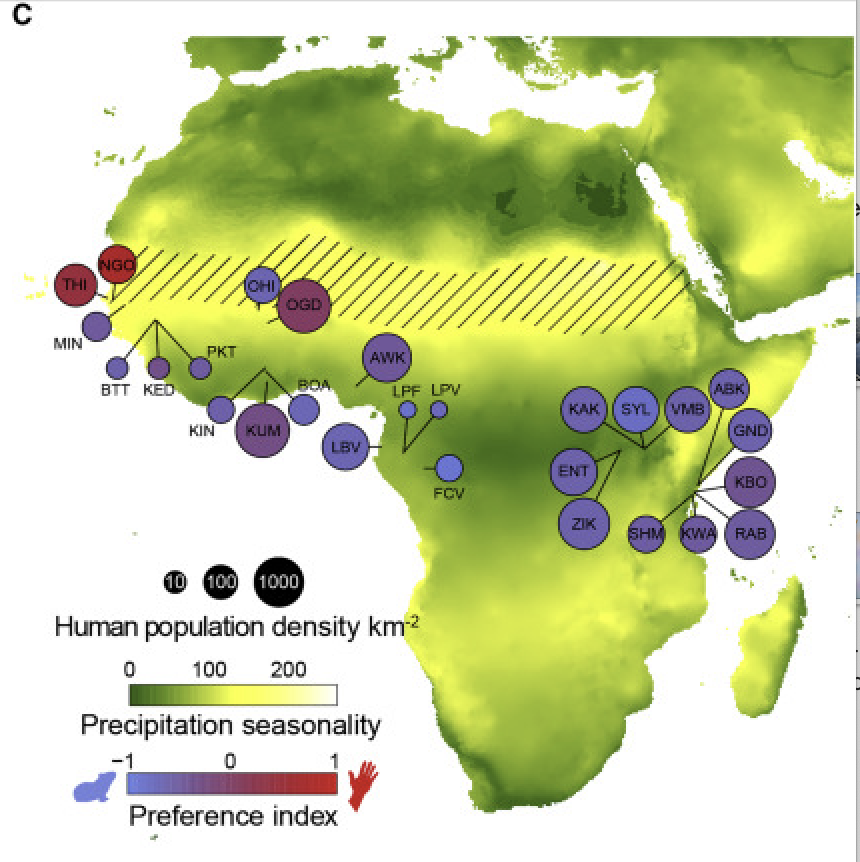

--- 
title: "Introduction to Genomics"
site: bookdown::bookdown_site
documentclass: book
bibliography: [book.bib, packages.bib]
biblio-style: apalike
link-citations: yes
description: " "
---

# Intro to Genomics in Natural Populations

Placeholder


## Course Learning Objectives
## Meet your instructors!
## Getting your Farm Account set up (class specific)

<!--chapter:end:index.Rmd-->


# Week 1- Welcome!

Placeholder


## Main Objectives
## How to access the shell via Farm OnDemand
## Navigating your file system
## Shortcut: Tab Completion
## Creating our own directories 
## Full vs Relative Paths
## Examining the contents of other directories
## Group Work Activity- Treasure Hunt!
## Key Points

<!--chapter:end:01-Week1.Rmd-->


# Week 2- Working with Files

Placeholder


## Main Objectives:
## Navigational shortcuts
## Sequencing Pipeline
## Details on the FASTQ format
## Our data set: FASTQ files
## Wildcards
## Command History
## Examining Files
## Group Work Activity- Examining a Fastq File
## Key Points

<!--chapter:end:02-Week2.Rmd-->


# Week 3- Working with Files Part 2

Placeholder


## Main Objectives
## Creating, moving, copying, and removing
### Copying Files
### Creating Directories
### Moving / Renaming 
### File Permissions
### Removing
## Searching files
## Redirecting output
## File extensions
## Writing for loops
## Using Basename in for loops
## Writing Scripts and Working with Data
## Writing scripts: Bash
## Writing scripts: Slurm
## Group Work Activity- Writing your own script
## Key Points
## Additional Information 
### Uploading and Downloading Data to your Virtual Machine with scp - UNIX
## More ways to work with files
### Awk

<!--chapter:end:03-Week3.Rmd-->


# Week 4- What is a Genetic Variant?

Placeholder


## Main Objectives
## Step 1: Download data
### Getting data from the cloud
### tools for today's class
## Step 1.2: Raw read quality control
## Step 2: Trimming to remove adapters
## Step 3: Building an index of our genome
## Step 4: Map reads to the genome
## Step 5: sam to bam file conversion
## Step 6: Genotype likelihoods
## Group Work Activity- Calling Variants at a Larger Scale
## Key Points

<!--chapter:end:04-Week4.Rmd-->


# Week 5- Welcome to the R environment!

Placeholder


## Main Objectives
## Orientation to R
## Manipulating a vector object
## Operations act on each element of a vector:
## Operations can also work with two vectors:
## A few tips below for working with objects:
## Characterizing a dataframe
## How to access parts of the data:
## Data Manipulation
## Group Work Activity: practice exploring a dataframe
## Key Points

<!--chapter:end:05-Week5.Rmd-->


# Week 6- Plotting in R

Placeholder


## Main Objectives
## Subsetting datasets & logicals
## Plotting in Base R
### Scatterplots
### Histograms
## Plotting with ggplot2
## For loops and the apply family of functions
## Group Work Activity: Palmer Penguins!
## Key Points

<!--chapter:end:06-Week6.Rmd-->


# Week 7- Population Structure & Sea Cucumbers

Placeholder


## Main Objectives:
## Download the data in terminal
## Moving to R:
## Installing Packages
## Set Working Directory
## read vcf file
## read in the metadata
## population structure with tess3r
## How do we know which K to pick?
## Visualizing population structure with pophelper!
## Adding more meaning to our plot
## Group Work Activity- Adding more context to our plot
## Key Points

<!--chapter:end:07-Week7.Rmd-->

---
title: "08-Week8"
author: "M. Armstrong"
date: "2025-05-08"
output:
  bookdown::html_book:
    toc: yes
    css: toc.css
---

```{r setup8, include=FALSE}
knitr::opts_chunk$set(echo = TRUE)
```

# Week 8: PCAs & Mosquitos

We will be using an *Ae. aegypti* mosquito population genomic data from a paper by Rose et al. (2020) titled ["Climate and Urbanization Drive Mosquito Preference for Humans"] [https://www.cell.com/current-biology/fulltext/S0960-9822(20)30978-7?referringSource=articleShare](https://www.cell.com/current-biology/fulltext/S0960-9822(20)30978-7?referringSource=articleShare){.uri}

These samples were taken across Central Africa, shown in this figure:



*Ae. aegypti* has only 3 chromosomes, but the raw dataset is quite large, so we have subsetted the vcf file from this study to contain only the first chromosome. We will use this subsetted vcf to create a principle component analysis (PCA) and learn how to visualize variation in this dataset. 

## Main Objectives:

- Learn what an eigenvalue and an eigenvector are and what information they give us
-   Learn how to interpret a principle component analysis (PCA)
-   Visualize population genomic data using a PCA

## Download the data in terminal

We first need to download the data in terminal. So navigate to your directory and do the following command to get the vcf file we need onto your farm desktop. I got the data from a data repository for this paper and modified it to be easier to work with in class.

``` html
cd /group/rbaygrp/eve198-genomics/yourdirectory
wget https://raw.githubusercontent.com/mlarmstrong/IntroGenomics_Data/main/week8.zip
```

Unzip the week8 directory and navigate inside. There should be two files: `simple_meta.csv` is our metadata file and `NC_035107.small.vcf.gz` is our subsetted vcf file with our genomic data.

## Moving to R & Installing Packages

Now we will move to R! We will need to install several packages today. 

- SeqArray()
- gdsfmt()
- SNPRelate()
- ggplot2()


`SeqArray()` to help us reformat our vcf file to a Genomic Data Structure (GDS) that is easier to read in for our principle component analysis (PCA). We need the package `SNPRelate()` to create a PCA from our genotype data. You will need to use Biocmanager to install both of these packages, so run `if (!require("BiocManager", quietly = TRUE)) install.packages("BiocManager")` and then `BiocManager::install(c("SeqArray", "SNPRelate"))`

We will also need `gdsfmt()` to open the newly created GDS formatted file and since it is a dependency for `SeqArray()`  it will actually download with that package installation. This package calculates the eigenvectors and eigenvalues for principal component analysis, meaning that it will look at how the samples are similar and different from one another and plot that variation using principle component axes. We will also need `ggplot2()`. After installing all of these packages be sure to load them with the commands below:

```{r, echo=T}
library(SeqArray)
library(gdsfmt) 
library(SNPRelate)
library(ggplot2)
```
## Set Working Directory
Now that we are working with downloaded data it is important to set your working directory in R so you know where to store your files. I would recommend just saving your script and all of the data for today into your week8 directory in your named directory. To set your working directory you can do the following: `setwd("~/where/you/are/storing/data/week8")`

If you click the files tab on the right you should be able to see all of the files in your working directory too!

## read vcf file

Now let's read in our vcf file and convert it to a gds object. 

```{r, echo=T}
vcf.mosq <- "NC_035107.small.vcf.gz"
seqVCF2GDS(vcf.mosq, "mosq.gds")
genofileseq.mosq <- seqOpen("mosq.gds")
```

Let's look at our object `genofileseq.mosq`. Our dataset has 393 mosquitos and 11855 SNPs. This object also has variant id, position, chromosome, allele, genotype data and additional information.
```{r, echo=T}
genofileseq.mosq
```

Now that our data is in the right format we can run our PCA! We want it to analyze the full dataset, so we set autosome.only to FALSE. This again tells us how many variants we have and the number of samples in our dataset.

```{r, echo=T}
pca.mosq<-snpgdsPCA(genofileseq.mosq, autosome.only=FALSE)
```

If we want to look at what class the object is and the column headers of our pca object we can run the following code.

```{r, echo=T}
class(pca.mosq)

names(pca.mosq) 
  
```
 
You should get class is a list and the column names are:  "sample.id" "snp.id"    "eigenval"  "eigenvect" "varprop"   "TraceXTX"  "Bayesian"  "genmat" 

Explore what each of these columns are and print only the top 10 rows

```{r, echo=T}
head(pca.mosq$sample.id, n=10)
```

-   sample.id is the name of our sample
-   snp.id is the name of our snp
-   eigenval is the eigenvalue of that snp
-   eigenvect is the eigenvector of that snp, or "# of samples" x "eigen.count"
-   varprop is the proportion of variation for each principle component
-   TraceXTX is the trace of the genetic covariance matrix
-   Bayesian is whether we used bayesian normalization (we did not)
-   genmat is the genetic covariance matrix

The column "sample.id" will be important for merging our metadata. The metadata will give more context to our snp data since we can provide information on how to categorize the variation present in our data.

If we plot or print our `pc.percent` object we can see that there are 32 pc axes but most of the variation is explained by pc 1 and 2. The amount of variation explained decreases with increasing pc axis number.
```{r, echo=T}
pc.percent<-pca.mosq$varprop*100
print(pc.percent)
```


```{r, label='8.0', echo=T}
plot(pc.percent)
```

This suggests that we should include many PC axes for our downstream analyses, but for now we will stick with 10.


## Read in Metadata

```{r, echo=T}
#Population meta
metadata<-read.csv('simple_meta.csv', header=TRUE, sep=',')
```

If we run `View(metadata)` you can see that our metadata has two columns, `Sample_ID` and `Site_ID`. `Sample_ID` matches our header `sample.id` in our `pca.mosq` data. We can combine the metadata with our `pca.mosq` object and pull the top 10 PC axes. This creates a new object called `tab`. You can look inside `tab` using `View(tab)`

## Prepare for Plotting

```{r, echo=T}
#look at pc.percent values in environment
tab<- data.frame(Sample_ID=pca.mosq$sample.id,
                 EV1=pca.mosq$eigenvect[,1], 
                 EV2=pca.mosq$eigenvect[,2],
                 EV3=pca.mosq$eigenvect[,3],
                 EV4=pca.mosq$eigenvect[,4],
                 EV5=pca.mosq$eigenvect[,5],
                 EV6=pca.mosq$eigenvect[,6],
                 EV7=pca.mosq$eigenvect[,7], 
                 EV8=pca.mosq$eigenvect[,8], 
                 EV9=pca.mosq$eigenvect[,9], 
                 EV10=pca.mosq$eigenvect[,10])

```


Now let's plot our data!

```{r, label='8.1', echo=T}
#PLOT

ggplot(tab, aes(x = EV1, y = EV2)) +geom_point()
```

This doesn't show us much, just that there is a lot of variation along PC1! But we don't have any information about these samples, so we want to use the metadata to contextualize what we are looking at. So let's  modify the code to fill in our dots by Site_ID. We want to make sure that variable is read as a factor, which is why we add the specification `as.factor()`

```{r, label='8.2', echo=T}
#PLOT
ggplot(tab, aes(x = EV2, y = EV1, color=as.factor(metadata$Site_ID)) +geom_point()
```
This helps but we don't really know what each of these site labels really mean. Let's go back to the metadata and add some more context.

We are going to use a package called `dplyr()` to modify our metadata. Remember to `install.packages()` first and then load the package
```{r, echo=T}
library(dplyr)
```
From reading the paper we can assign an additional column of information for each of our samples with "region". We need to match up our site IDs to a new column that we will make with country information, but first we need to see how many unique sites there are and the names of those sites:

```{r, echo=T}
unique(metadata$Site_ID)
```

Now that we know there names, we can write code to add in a new column and assign it by what the site ID says:
```{r, echo=T}
metadata <- metadata %>%
  mutate(country = case_when(
    Site_ID %in% c("BUN", "KAR", "ENT", "KCH") ~ "Uganda",
    Site_ID %in% c("BTT", "THI", "KED", "MIN", "NGO", "PKT") ~ "Senegal",
    Site_ID == "AWK" ~ "Nigeria",
    Site_ID == "MASC" ~ "Mauritius",
    Site_ID %in% c("ABK"  ,  "GND" ,   "KAK" ,   "KBO" ,   "KWA"   , "RAB" ,   "SHM", "VMB",  "RABaaf", "RABd") ~ "Kenya",
    Site_ID %in% c("BOA", "KIN", "KUM") ~ "Ghana",
    Site_ID %in% c("FCV", "LBV", "LPV") ~ "Gabon",
    Site_ID %in% c("BGR", "OGD", "OHI", "GOU") ~ "Burkina Faso",
    Site_ID == "SAN" ~ "Brazil",
    Site_ID == "BKK" ~ "Thailand"
  ))

```

Look at the metadata file again with `View(metadata)` to check if it worked! There should be a new column called `country`

```{r, label='8.3', echo=T}
#PLOT
ggplot(tab, aes(x = EV1, y = EV2, color=as.factor(metadata$country))) +geom_point()
```

This graph is a lot more informative! We see that the points on PC1 and PC2 are heavily grouping by country.


Finally let's really customize our graph with labels, a legend and unique colors! Install/load `library(RcolorbBrewer)` for the colorscheme in the pca. You can type `?RColorBrewer` for a help tab to pop up where you can see the other color palettes in this package.


To get the percentages I filled into the labels you can run this code from earlier:

```{r, echo=T}
print(pc.percent) #to get the values for the pca plot axes
```

```{r, label= '8.4', echo=T}
ggplot(tab, aes(x = EV1, y = EV2, color=as.factor(metadata$country)))+
  geom_point()+
  labs(x = 'PC1 10.4020498%', y='PC2 4.9636990%', color = "country")+
  scale_colour_brewer(palette = "Paired")+
  theme_minimal(base_size=10)
```

## Group Work Activity- What can the other PC axes tell us?

- Q1)  We only explored PC1 and PC2 in class, but what can the other PC axes tell us? Plot the remaining PCs (PC3 through PC10) with country as color and interpret what the PCAs are showing you. Feel free to change the color scheme (just make sure you use `Paired` or `Set3` if you are using RColorBrewer so there are enough colors) and make sure to change the axis labels. 

- Q2) In the paper, the authors plotted their PCA by region rather than country. Add a new column to your metadata for region and replot PC1 vs PC2. Code Thailand and Brazil as "America/Asia".   West Africa includes Senegal, Burkina Faso, Ghana and Nigeria. Central Africa includes Gabon and Uganda. For simplicity sake, code all of the Kenyan sites as Coastal East Africa along with Mauritius (although in the paper Kenya spans both the Central Africa and Coastal categories).

Turn in your code for how you made your PCAs, how you added region to your metadata file and the four PCAs for question 1 and 1 PCA for question 2 on canvas.


## Key Point
-  PCAs can be really useful for visualizing variation in genomic data, and by adding different categories with metadata you can detect patterns within your data

<!--chapter:end:08-Week8.Rmd-->

