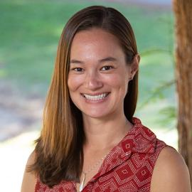

--- 
title: "Introduction to Genomics"
site: bookdown::bookdown_site
documentclass: book
bibliography: [book.bib, packages.bib]
biblio-style: apalike
link-citations: yes
description: " "
---
# Intro to Genomics in Natural Populations
Wednesdays 10-11:50am, Storer 1350
Office Hours TBD

Instructors:  Rachael Bay (rbay@ucdavis.edu) & Madison Armstrong (mlarmstrong@ucdavis.edu), Office Hours: TBD


## Course Learning Objectives
In this course we will focus on the rapidly developing field of genomics and explore examples across marine and terrestrial systems. Students will gain hands-on coding skills in command-line and R. By the end of this class, students will be able to use HPC computing resources at UC Davis, write basic scripts in bash and perform genomic analyses modifying template scripts in R. Students will also be able to describe the general bioinformatics pipeline and  evaluate figures from published literature.quired, and is also your first book chapter. It will be the homepage when you render the book.

## Meet your instructors!

Madison Armstrong, PhD student, instructor (mlarmstrong@ucdavis.edu)-- [Website](https://madisonarmstrong.me/)


Rachael Bay, Assistant Professor, co-instructor (rbay@ucdavis.edu)-- [Website](https://baylab.github.io/).


## Getting your Farm Account set up (class specific)
For this course we will be using Farm OnDemand. First go to UCDavis HiPPO (the high-performance personnel onboarding) site and make an account: <https://hippo.ucdavis.edu/Farm/myaccount>. The group will be: rbay-eve198-genomics-grp and the supervising PI is: Rachael Bay. If you already have access to a farm account, click “request access to another group” and fill in the same information.

A text box will pop up. Fill out name and other information for a farm account. Two boxes will be clicked: unclick SSH (you will not have an SSH key) and make sure “ondemand” is clicked.

Once your account has been processed (you will get an email!) you will use this site to complete all coursework: <https://ondemand.farm.hpc.ucdavis.edu/pun/sys/dashboard/>.

```{r include=FALSE}
# automatically create a bib database for R packages
knitr::write_bib(c(
  .packages(), 'bookdown', 'knitr', 'rmarkdown'
), 'packages.bib')
```
